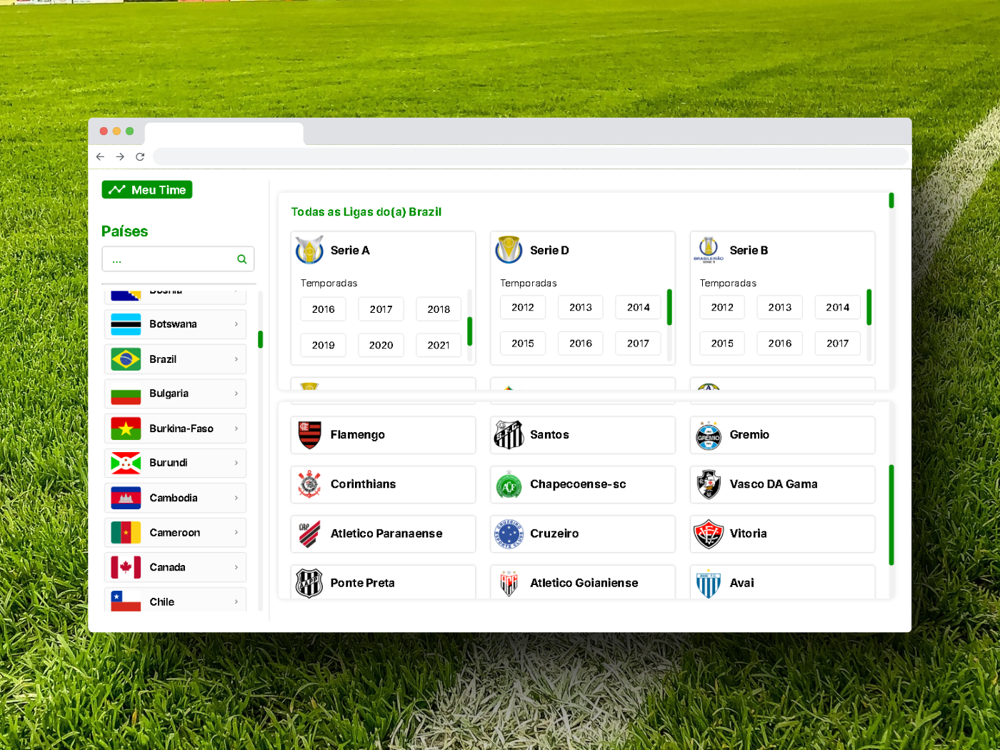

# Meu-Time
### Aplicação criada para o teste de front-end da empresa Trade Technology



## Sobre

**Meu Time** é uma aplicação web front-end com o objetivo de buscar dados das principais ligas, times e jogadores de futebol do mundo, utilizando uma API chamada [_API-FOOTBALL_](https://www.api-football.com/documentation-v3).

## Tecnologias
Para o desenvolvimento desta aplicação, utilizei **ReactJS** usando o [_Vite_](https://vitejs.dev) como ferramenta de contrução, isso faz com que a aplicação inicie mais rapidamente e com maior performance, para mostrar os gráficos de alguns dados pedidos no teste, utilizei a biblioteca [_ChartJS_](https://www.chartjs.org) que é uma forma bem prática de mostrar dados vindos de um JSON diretamente para o front-end, tudo isso está hospedado ao vivo neste momento usando a conta **Hobbie** na **Vercel** que você pode acessar por [**Aqui**]()


## Desafios no desenvolvimento

### Mockup
Na documentação do teste, há um ponto que cita:
> São considerados diferenciais: - Criar protótipo baseado no mockup desejado

infelizmente não encontrei nenhuma referência na documentação ou na plataforma do Gupy que me mostrassem um modelo, mas mesmo assim decidi continuar a desenvolver o app.

### Typescript
Não entendi bem se era obrigatório o uso de typescript para desenvolver a aplicação, como não estou naturalmente habituado com ele, decidi fazer usando Javascript.

### Gráficos
Apesar de já ter trabalho como desenvolvedor front-end, nunca tinha usado gráficos em nenhum projeto ou trabalho, foi a primeira vez que consegui entender e me acostumar com a apresentação de dados nesta forma.

### Testes de integração
Outro hábito que não estou acostumado a ter são os de testes, não implementei nenhuma forma de testes automatizados além dos testes de performance do próprio inspetor do navegador, mas é algo que já está no meu radar para afiar os conhecimentos.

### Containerização
Containers e imagens Docker são coisas muito novas nos meus estudos, é outra vertente que espero me aprofundar este ano para buscar ainda mais velocidade e performance nos projetos.


## Como executar localmente?

Ao clonar o repositório do teste, basta acessar a pasta do projeto na raiz e iniciar com o vite desta forma:

```console
usuario@local:~$ cd meu-time
usuario@local:~$ npm run dev
```

## Funcionamento do Sistema
Apesar de ser uma API incrívelmente poderosa, o plano gratuito permite apenas 100 requisições por dia (exceto as requisições de verificação de status), o que me fez levar mais de um dia para terminar o teste, no entanto, lendo a documentação e sabendo exatamente quais _endpoints_ eu realmente precisava, as coisas fluíram bem melhor.

Vamos olhar para os requisitos de desenvolvimento da aplicação e entender como foi feito o fluxo e jornada de desenvolvimento do projeto:

### Critérios de Aceite:
<br/>

> " Deve ser possível realizar login com a API Key de autenticação da API_Football "

<br/>

Todo o usuário precisará criar uma conta no site da [_API-Sports_](https://api-sports.io) para que consiga a chave de API para poder logar no app, pois todas as informações virão fazendo requisições da sua chave de API, na tela de login da minha versão deste app, você encontra um link para caso nao possua uma chave, ser redirecionado para a documentação para descobrir como gerar a sua. 

A partir deste requisito, todas as outras operações podem ser efetuadas como: 
- Só é possível acessar a home do app com um login efetuado;
- Para que o usuário possa listar times, ligas e outras informações, primeiro ele deve selecionar um país;
- Para que o usuário selecione um time, ele deve selecionar uma liga e a temporada desejada, essas informações são trazidas no momento em que o usuário seleciona um país (um fato curioso é que se quisermos selecionar **competições internacionais** como **Champions League** e a **Copa do Mundo** o "País" que o usuário deverá buscar se chama **"World"** 🌎).


### Conclusão

Contudo, aperfeiçoei bastante meus conhecimentos em React e ainda mais usando Hooks e as boas práticas do React, que é algo que não tenho completo domínio, porém ainda sigo no foco de entregar interfaces incríveis focadas em conversão e resultados, espero que os recrutadores gostem do resultado apresentado e que desde já saibam que agradeço a oportunidade, e se caso qualquer outro dev quiser, saiba que é livre para clonar e modificar o que quiser!

Obrigado